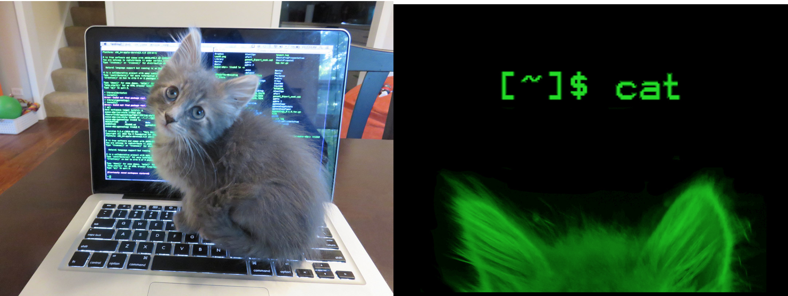
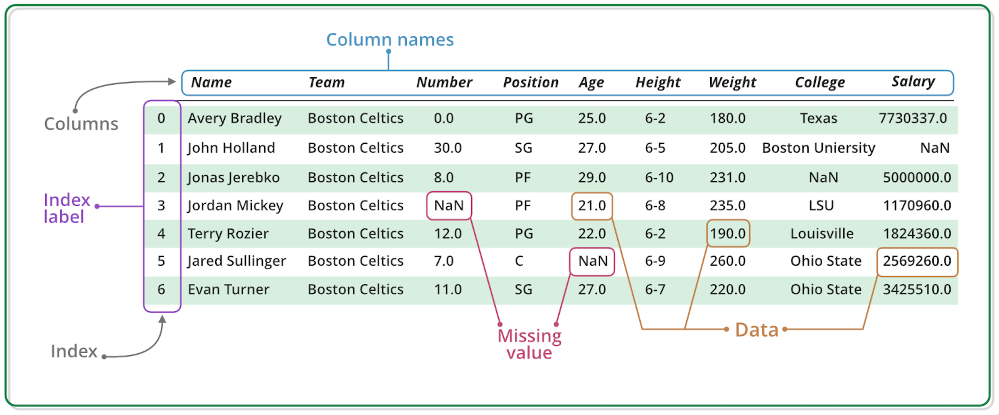

```{r setup, include=FALSE}
knitr::opts_chunk$set(echo = TRUE)
```

# File types
## R Script

* Text file containing a set of commands and comments (`#`)
* Script can be saved and used later to re-execute the saved commands
* Script can be edited so you can execute a modified version of the commands.
* Saves as `.R` file

---

## R Shiny Web App

* Interactive web apps made in R
* [Demonstrations](https://shiny.rstudio.com/gallery/)
* [Personal application](https://bigpint.shinyapps.io/litre/)
* [Basic widgets](https://shiny.rstudio.com/tutorial/written-tutorial/lesson3/)
* Saves as `app.R` file

---

## R Markdown

* Lets you mix text with code for R, Python, etc
* Text is in [R Markdown](https://rmarkdown.rstudio.com/authoring_basics.html)
* Saves as `.Rmd` file
* Outputs to HTML, docx, LaTeX (PDF)
* Uses ` ``` ` for R chunks

---

## R Sweave

* Lets you mix text with code for R, Python, etc
* Has mostly been upgraded to [knitr](https://cran.r-project.org/web/packages/knitr/index.html)
* Saves as `.Rnw` file
* Outputs to LaTeX (PDF)
* Uses `<<>>=` and `@` for R chunks

---

## Knitr
* Processes both Markdown and Sweave files

---

# Online resources

* [RStudio Cheat sheets](https://rstudio.com/resources/cheatsheets/)
    * [Rmarkdown](https://rstudio.com/wp-content/uploads/2016/03/rmarkdown-cheatsheet-2.0.pdf)
    * [ggplot2](https://rstudio.com/wp-content/uploads/2015/03/ggplot2-cheatsheet.pdf)
* [Stackoverflow](https://stackoverflow.com/)

---

# RStudio layout

* Source
* Console
* Environment (History)
* Other (Files, Plots, Help function)

---

# Arithmetic

The pound sign (`#`) is used for comments in R. Below are some of the most common syntax for arithmetic in R.

```{r}
# Addition
5+10
```

```{r}
# Subtraction
100-6
```

```{r}
# Multiplication
4*9
```

```{r}
# Division
(5 + 5) / 2
```

```{r}
# Exponentiation
2^4
```

```{r}
# Modulo
18 %% 5
```

---

# Variable assignment

A basic tool in statistical programming is called a variable. A variable allows users to store a value (e.g. 7) or an object (e.g. a function description). You can then the name of the variable later on  to easily access the value or the object that is stored within it. When creating a variable in R, use the `<-` or `=` grammar with the variable name on the left and the variable value on the right.

```{r}
# Assign the value 19 to x
x <- 19

# Print out the value of the variable x
x
```

We can perform arithmetic on variables.

```{r}
# Assign the value 7 to y
y <- 7

# Add the values of x and y and store the result in z
z <- x + y

# Print the value of z
z
```

You can store a function as a variable. Here we create a function that adds two values. The name of the function is `sumTwoValues`. The function requires the user to input two variables with values (two "input parameters"). The function then adds the values of the two variables the user input and stores into a variable called `sum`. The value of `sum` is then returned to the user. 

```{r}
sumTwoValues <- function(x, y) {
  sum <- x + y
  return(sum)
}
```

Now, if we call the function name, it will simply list the code of the function.

```{r}
sumTwoValues
```

To actually use the function, we must call the function name (`sumTwoValues`) and input the two required variables (`x` and `y`).

```{r}
x <- 1 
y <- 2
sumTwoValues(x, y)
```

```{r}
sumTwoValues(x=100,y=80)
```

Here is another example of creating a function in R that converts fahrenheit to celsius. This function requires one input parameter `temp_F` from the user.

```{r}
fahrenheit_to_celsius <- function(temp_F) {
  temp_C <- (temp_F - 32) * 5 / 9
  return(temp_C)
}
```

We can call the function as follows:

```{r}
temp_F <- 30
fahrenheit_to_celsius(temp_F)
```

Or as follows:

```{r}
myTempF <- 30
fahrenheit_to_celsius(myTempF)
```

Now, we can run various variations of the same function using different input paramater values of interest:

```{r}
fahrenheit_to_celsius(30)
fahrenheit_to_celsius(40)
fahrenheit_to_celsius(50)
fahrenheit_to_celsius(60)
fahrenheit_to_celsius(70)
```

We won't go into details of loops in R. These can be found in many online tutorials. But for demonstrative purposes, the code above could be further reduced as follows:

```{r}
for (t in seq(from = 30, to = 70, by = 10)){
   print(fahrenheit_to_celsius(t))
}
```

How did this work? First, let's look at the `seq()` function. This is built-in R function. If we run the name of the function, we will only see the code of the function, which is not helpful.

```{r}
seq
```

Instead, let's run a `help()` command on the `seq()` function. We can do this by running either of the two below commands:

```{r}
help(seq)
?seq
```

Both below code perform the same task and create the values 30, 40, 50, 60, 70. Note that you do not have to explicitly call the input parameter name for the command to work.

```{r}
seq(from = 30, to = 70, by = 10)
seq(30, 70, 10)
```

---

# Basic data types in R

R uses various data types. Some of the most basic types to get started are characters, numerics, integers, and logicals. 

* Decimal values like 9.3 are called numerics.
* Whole numbers like 6 are called integers. Integers are also numerics.
* Boolean values (TRUE or FALSE) are called logical.
* Text (or string) values are called characters.

```{r}
# Set my_numeric to be 9.3
my_numeric <- 9.3

# Set my_character to be "mouse"
my_character <- "mouse"

# Set my_logical to be TRUE
my_logical <- TRUE
```

We can update the variable we stored to have new values.

```{r}
# Change my_numeric to be 10
my_numeric <- 10

# Change my_character to be "mars"
my_character <- "mars"

# Change my_logical to be FALSE
my_logical <- FALSE
```

The `str()` function is very useful in R to help you understand what data type and values are associated with variables.

```{r}
# Run str() on my_numeric
str(my_numeric)

# Run str() on my_character
str(my_character)

# Run str() on my_logical
str(my_logical)
```

Note that you can determine all variables you have stored in your current R session by typing:

```{r}
ls()
```

You can remove all variables in your current R session using the `rm(list=ls())` function:

```{r}
rm(list=ls())
```

---

# Basic data structures in R

R has several data structures. These include atomic vector, list, matrix, factors, and data frame.

## Vectors

Vectors are collections of elements that are usually of mode character, logical, integer or numeric. We can create an empty vector using `vector()`. (By default the mode is logical.)

```{r}
# an empty 'logical' (default) vector
vector()
```

```{r}
# a vector of mode 'character' with 3 elements
vector("character", length = 3)
```

```{r}
 # the same results, but using the constructor directly
character(3)
```

You can also generate vectors by directly specifying their contents. R will then infer the appropriate mode of storage for the vector.

```{r}
# create a vector x of mode numeric
x <- c(1, 2, 3)
```

```{r}
# create a vector y of mode logical Using TRUE and FALSE
y <- c(TRUE, TRUE, FALSE, FALSE)
```

```{r}
# create a vector z of mode character using quoted text
z <- c("Nailil", "Quang", "Kaness")
```

In addition to `str()`, you can also examine vectors using `typeof()`, `length()`, `class()`.

```{r}
str(z)
typeof(z)
length(z)
class(z)
```

You can add elements to vector using the combine (`c()`) function.

```{r}
z <- c(z, "Sunanda")
```

```{r}
z <- c("Fujita", z)
```

R allows missing data in vectors. Missing data are represented as `NA` (Not Available). The function `is.na()` informs which elements of vectors are missing data, and the function `anyNA()` returns `TRUE` if the vector contains at least one missing value.

```{r}
x <- c("a", NA, "c", "d", NA)
y <- c("a", "b", "c", "d", "e")

is.na(x)
is.na(y)

anyNA(x)
anyNA(y)
```

You can mix different types within a vector In that case, R will create a vector with a mode that seems to best accommodate all the elements it contains. Conversion between modes of storage is known as "coercion". For example, gues what the following mixed-type input vectors end up as their storage.

```{r}
mixX <- c(3.3, "p")
mixY <- c(TRUE, 5)
mixZ <- c("q", TRUE)
```

See if your guess is correct!

```{r}
str(mixX)
str(mixY)
str(mixZ)
```

---

## Matrices

In R, matrices are an extension of numeric or character vectors. They are simply vectors with dimensions (the number of rows and columns). As with vectors, the elements of a matrix must be of the same data type.

```{r}
m <- matrix(nrow = 2, ncol = 2)
m
```

We can investigate our matrix using various attribute functions (like `dim()`, `class()`, and `typeof()`.

```{r}
dim(m)
class(m)
typeof(m)
```

We can fill this matrix in with values, which is done in R column-wise. 

```{r}
m <- matrix(1:6, nrow = 2, ncol = 3)
```

Another way to fill matrices is to bind columns or rows using `rbind()` and `cbind()` ("row bind" and "column bind", respectively).

```{r}
x <- 4:6
y <- 10:12
m <- cbind(x, y)
```

```{r}
mdat <- rbind(x, y)
```

Elements of a matrix can be obtained by specifying the indices along each dimension (e.g. "row" and "column") in single square brackets.

```{r}
mdat[1,3]
```

---

## Lists

Lists act as containers in R. Unlike vectors, elements of lists can be more than one mode and can contain any mixture of data types. Lists are sometimes refered to as "generic vectors", because the elements of a list can by of any type of R object. Lists can even contain lists elements within themselves ("nested lists"). These properties makes lists fundamentally different from vectors.

```{r}
xList <- list(1, "a", TRUE)
xList
```

Elements within lists can be obtained using double square brackets.

```{r}
xList[[2]]
```

List elements can be named.

```{r}
nameXList <- list(myNum = 1, myChar = "t", myBool = TRUE)
nameXList
names(nameXList)
```

We can obtain the element values within the named list by calling the name with the `$` notation.

```{r}
nameXList$myChar
```

Lists can be very helpful inside functions. This is because functions in R can only return a single object. Therefore, you can "concatentate" (staple) together numerous results values into a single object that the function can then return.

---

## Data frames

A data frame is one of the most important data types in R and is often used for tabular information in statistics. A data frame is a list, where every element has the same length (i.e. data frame is a "rectangular" list).



* Data frame can be created by importing data into R (`read.csv()` and `read.table()`)
* If all columns in a data frame are the same type, a data frame can be converted to a matrix using `as.matrix()`
* Data frame can be created in R with `data.frame()` function.
* Rownames are often automatically generated as 1, 2, ..., _n_. Row numbers can become inconsistent when data frame is reshuffled or subset.

We can create a data frame below.

```{r}
df <- data.frame(id = letters[1:10], var1 = 1:10, var2 = seq(11,30,2))
df
```

There are many useful data frame functions:

* `head()` - shows top 6 rows
* `tail()` - shows bottom 6 rows
* `dim()` - returns  dimensions of data frame (number of rows and columns)
* `nrow()` - number of rows
* `ncol()` - number of columns
* `str()` - structure of data frame - name, type and preview of data in each column
* `names()` or `colnames()` - both show the names attribute for a data frame
* `sapply(dataframe, class)` - shows the class of each column in the data frame

```{r}
head(df)
tail(df)
dim(df)
nrow(df)
ncol(df)
str(df)
names(df)
sapply(df, class)
```

Since data frames are rectangular, elements of data frames can be accessed by specifying the row and the column index in single square brackets.

```{r}
df[2, 3]
```

Since data frames are special forms of lists, we can obtain columns using the list notation, i.e. either double square brackets or a $.

```{r}
df[["var2"]]
df$var2
```

If you are used to working with Excel-like format, you can also "View" the data frame in that format as follows:

```{r, eval = FALSE}
View(df)
```

Since statisticans often work with data frame structures, packages have been written that allow for additional smooth use and manipulation of data frames in addition to base R functions. One popular package for working with data frames in [dplyr](https://dplyr.tidyverse.org/).

---

# Reading and writing data into R

Scientists often store data in Excel spreadsheets. There are various R packages that can help R users access data from Excel spreadsheets (XLConnect, gdata, RODBC, RExcel, and xlsx). However, many users find it simpler to save their spreadsheets in comma-separated values files (.CSV) and then use base R functionality to read and manipulate the data.

We can read in a CSV file (`Labmates.csv`) that contains each of our names and spirit animals. First, make sure you are located in the directory where the file is located. You can do this using the "set working directory" command (`setwd()`) or by manually choosing "Set As Working Directory" in your RStudio space. Then, you should be able to run the command:

```{r}
my_data <- read.csv("data/Labmates.csv")

```

It may be easier as well to run the following command, which will open a GUI that allows you to select the file. location and the file.

```{r, eval = FALSE}
my_data <- read.csv(file.choose())
```

Looks like we each have a spirit animal. Vinh san is not happy. He really loves cats. Plus, he really does not want to have a pangolin as a spirit animal these days. Let's switch the spirit animal of Vinh and Lindsay (who originally had cat). Then, let's also add a column to indicate who attended the R crash course today.


```{r, eval = FALSE}
my_data[2,2] = "Cat"
my_data[7,2] = "Pangolin"
my_data$Attendance = c(1,1,1,1,1,0,1)
```

Now, we can save/write our updated file to a desired location. 

```{r, eval = FALSE}
write.csv(my_data, file = 'data/LabmatesAttendance.csv')
```

If you do not like the first column with the indices, you can save as follows:

```{r, eval = FALSE}
write.csv(my_data, file = 'data/LabmatesAttendance.csv', row.names = FALSE)
```

Note there is also a very flexible storage format in R in which you can save any type of object (not just CSV or data frame). This can be done with the RDS file format using the `saveRDS()` and the `readRDS()` functions.

```{r, eval = FALSE}
exampleVariable = saveRDS(my_data, file = "data/LabmatesAttendance.Rds")
```

We can now read in the object and, if desired, set it to a new variable `attendanceRDS`.

```{r, eval = FALSE}
attendanceRDS <- readRDS("data/LabmatesAttendance.Rds")
str(attendanceRDS)
```

---

# Example data in R

There are numerous built-in datasets in R that you can use to practice and/or to create "minimal working examples" when you cannot use your real data. You can see a list of example R datasets by typing:

```{r}
data()
```

One example dataset is `mtcars`. We can load it and examine it.

```{r}
data(mtcars)
str(mtcars)
```

---

# Graphics in R

There are numerous basic plotting types in R that do not require using extra packages. For each plot, there is often a more powerful equivalent using `ggplot2()`, which we need to first install. The `ggplot2()` package is on [CRAN](https://cran.r-project.org/web/packages/ggplot2/index.html). For packages installed on CRAN, we can install using the `install.packages()` function. We can then read the package into our current R session using the `library()` function. 

```{r, eval = FALSE}
install.packages("ggplot2")
```

```{r}
library(ggplot2)
```

---

## Scatterplots

In base R, we can perform using:

```{r}
plot(x = mtcars$wt, y = mtcars$mpg)
```

It can also be performed in ggplot2 using `qplot()`:

```{r}
library(ggplot2)
qplot(x = mtcars$wt, y = mtcars$mpg)
```

---

## Line plots

We can create a line plot based on the `pressure` dataset in R.

```{r}
plot(x = pressure$temperature, y = pressure$pressure, type = "l")
```

We can instead pass the argument type = "s" to produce a stepped line chart:

```{r}
plot(x = pressure$temperature, y = pressure$pressure, type = "s")
```

We can use `qplot()` to get similar results by using the `geom` argument. In graphics, `geom` are geometric objects (lines, points, etc.) that visually represent the data. In this case, we can represent the data using a line and then also points:

```{r}
qplot(temperature, pressure, data = pressure, geom = "line")
```

```{r}
qplot(temperature, pressure, data = pressure, geom = "step")
```

```{r}
qplot(temperature, pressure, data = pressure, geom = c("line", "point"))
```

There are countless other plots that can be made in base R and `ggplot2`, including box plots, bar plots, histograms, stem and leaf plots, mosaic plots. There are great online resources to practice making plots and entire textbooks. As shown earlier in this tutorial, there are also [cheat sheets](https://rstudio.com/wp-content/uploads/2015/03/ggplot2-cheatsheet.pdf) available in R Studio. With `ggplot2` graphics, you can also use additional packages to render them interactive fairly easily. You can see neat examples of this from the function `ggplotly` [here](https://www.r-graph-gallery.com/interactive-charts.html).

# Downloading packages from multiple sources

There are various ways to download R packages from online resources. Three common ways are on CRAN, GitHub, and Bioconductor. As an example, the `ggplot2` package is available on CRAN [here](https://cran.r-project.org/web/packages/ggplot2/index.html). Hence, we could install the CRAN version using the code we already saw:

```{r, eval=FALSE}
install.packages("ggplot2")
```

You can also install the developmental version from GitHub (if there is one). It seems `ggplot2` has a GitHub repository [here](https://github.com/tidyverse/ggplot2). The functionality to install a repository from GitHub into R can be done with the `devtools` package, which is on CRAN. Here, we first install the `devtools` package, read it into our R session, and then use one of its functions (`install_github()`) to install the `ggplot2` version on GitHub.

```{r eval= FALSE}
# install devtools package
install.packages("devtools")
library(devtools)

devtools::install_github("tidyverse/ggplot2")
```

Some packages, especially ones that relate to bioinformatics, are on [Bioconductor](https://www.bioconductor.org/). For example, the RNA-seq analysis packages [DESeq2](https://bioconductor.org/packages/release/bioc/html/DESeq.html) and [edgeR](https://bioconductor.org/packages/release/bioc/html/edgeR.html) are on Bioconductor. If you try to install these packages using the CRAN functionality, you will get an error (`package ‘edgeR’ is not available (for R version 4.0.2)`).

```{r, eval = FALSE}
install.packages("edgeR")
```

Instead, to install a Bioconductor package into R, you will need the following type of code:

```{r, eval = FALSE}
if (!requireNamespace("BiocManager", quietly = TRUE))
    install.packages("BiocManager")

BiocManager::install("edgeR")
```

# Creating a minimal working example

Sometimes you cannot troubleshoot an error in R, even after thinking carefully and reading about potential underlying causes. One thing you may want to do in that case is ask a colleague or post on [StackOverflow](https://stackoverflow.com/). Sometimes you cannot show your real data (due to privacy issues). Moreover, on StackOverflow, you cannot upload any data. Hence, you often need to create a "minimal working example": that is, a simulated dataset that has the same data types and formats as your real data that can be used to simulate the error. Let's look at an example of how to do this.

Say, you are working with a sensitive dataset. Let's read it in first.

```{r}
senDF <- readRDS("data/sensitiveData.Rds")
```

We can see this dataset contains patient names, sound gene count information, and a phenotype that could be sensitive (cancer status, mental illness, etc).

```{r}
str(senDF)
```

Say you wanted to sum up all the gene counts in this dataset. Usually, this can be achieved easily by applying the `sum()` function to the corresponding column. However, when we try to do this, we receive an error ("'sum' not meaningful for factors"): 

```{r, eval=FALSE}
sum(senDF$geneCount)
```

If you are unable to figure out this error and want to consult colleagues or StackOverflow, you will need to provide code to them that creates a minimal working example data frame (`mweDF`) that has the same data types as your sensitive data frame (`senDF`).

```{r}
patient = paste0("Patient", 1:100)
geneCount = as.factor(sample(1:100, 100, replace=TRUE))
phenotype = sample(c("Yes","No"), 100, replace = TRUE)
mweDF = data.frame(patient = patient, geneCount = geneCount, phenotype = phenotype)
str(mweDF)
```

Then, your colleagues can simulate your error by running the `sum()` function on your simulated data frame.

```{r, eval = FALSE}
sum(mweDF$geneCount)
```

If they have more experience, they can then provide a suggestion. In this case, to change your `geneCount` column to be of numeric type.

```{r}
mweDF$geneCount = as.numeric(mweDF$geneCount)
```

Indeed, we now no longer get that error and can successfully sum that column.

```{r}
sum(mweDF$geneCount)
```

# Challenge with corrplot

Before her rotation ends, Sunanda wants to replicate a figure she found in a journal article that was created using the `corrplot` package. Based on this brief R crash course, are you able to replicate the first few figures from the [`corrplot` vignette?](https://cran.r-project.org/web/packages/corrplot/vignettes/corrplot-intro.html)


